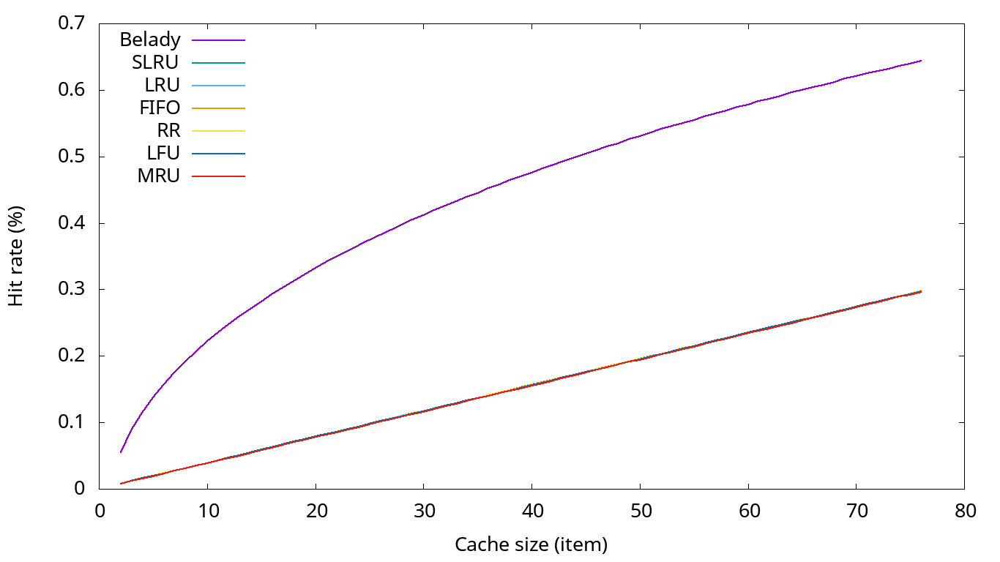

# Алгоритмы кэширования

В данном репозитории представлено:

  - программа, написанная на языке программирования Rust, в которой реализована
    имитация работы различных алгоритмов кэширования (алгоритмов вытеснения);
   
  - скрипты для проведения анализа работы алгоритмов кэширования, а также для
    создания графиков.
   
## Дисклеймер

Данная программа не предназначена для работы в реальных условиях, в ней не была
проведена оптимизация и рефакторинг кода, были использованы самые примитивные
структуры данных для уменьшения времени разработки. При возникновении той или
иной исключительной ситуации обработка исключений не происходит, программа
завершается с ошибкой. В качестве обрабатываемых данных используются
целочисленные значения (32bit), подразумевающиеся как адреса в памяти (ссылки на
записи).

## Установка и настройка стенда

Требуется установка таких зависимостей, как:
  - `rust 1.12`
  - `cargo 1.12`
  - `gnuplot 5.0`
  - `python 3.5`
  
### Сборка проекта

Проведение тестирования (необязательно):

``` shell
$ cargo test
```

Компиляция (исполняемый файл будет лежать в `./target/release`):
``` shell
$ cargo build --release
```
Для вывода информации по использованию:

``` shell
$ cargo run --release

```
или

``` shell
$ ./target/release/cache_algos
```


``` text
Usage: target/release/cache_algos -f PATH | -b COUNT_OF_BATCHES | -s SIZE_OF_BATCH [-L | -R [-r RANDOM_LOW RANDOM_HIGH]] [-S SIZE_CACHE] ALGO

Create RAM from FILE:
-f PATH                Create RAM from file

Create RAM from BUILDER:
-b COUNT_OF_BATCHES    Set count of batches
-s SIZE_OF_BATCH       Set size of one BATCH
-R                     Set random for all batches
-L                     Set random for one batch (range random is size of batch)
-r                     Set range limit of random
-S                     Set size of cache

Algorithms (ALGO variable):
BELADY, FIFO, LRU, LFU, RR, MRU, SLRU
```

Сбор данных производится настройкой и запуском скрипта `./analyse.py`.

Построение графиков производится настройкой файла `./gnuplot.plg` и запуском команды:

``` shell
$ gnuplot gnuplot.plg
```

## Описание используемых алгоритмов

В данной работе представлены нижеперечисленные алгоритмы кэширования (далее - АК).

*Описание представлено из статей Wikipedia:*

  - [Алгоритмы кэширования][Cache algorithms ru]
  - [Cache algorithms][Cache algorithms en]
  - [Page replacement algorithm][Page replacement algorithm]
  - [Cache-oblivious algorithm][Cache-oblivious algorithm]

### Алгоритм Белади

Наиболее эффективное правило вытеснения — отбрасывать из кэша ту информацию,
которая не понадобится в будущем дольше всего. Этот оптимальный алгоритм
кэширования назвали алгоритмом Белади или алгоритмом предвидения. Так как в
общем случае невозможно предсказать когда именно в следующий раз потребуется
именно эта информация, то на практике (опять же, в общем случае) подобная
реализация невозможна. Практический минимум может быть вычислен только опытным
путём, после чего можно сравнить с ним эффективность текущего алгоритма
кэширования.

### FIFO (Очередь)

Если искомый элемент не находится в кэше, он вставляется в хвост очереди. Если
нужно освободить место, удаляются элементы из головы очереди. Таким образом
вытесняется элемент, находящийся в кэше дольше всех.

### Least recently used (Вытеснение давно неиспользуемых)

В первую очередь, вытесняется неиспользованный дольше всех. Этот алгоритм
требует отслеживания того, что и когда использовалось, что может оказаться
довольно накладно, особенно если нужно проводить дополнительную проверку, чтобы
в этом убедиться. Общая реализация этого метода требует сохранения «бита
возраста» для строк кэша и за счет этого происходит отслеживание наименее
использованных строк (то есть за счет сравнения таких битов). В подобной
реализации, при каждом обращении к строке кэша меняется «возраст» всех остальных
строк.

### Least-Frequently Used (Наименее часто используемый)

LFU подсчитывает как часто используется элемент. Те элементы, обращения к
которым происходят реже всего, вытесняются в первую очередь.

### Random Replacement (Случайное замещение)

Кандидат для удаления из кэша при промахе выбирается случайно. Данный алгоритм
не требует содержать информацию об истории и времени использования элементов
кэша. Из-за простоты алгоритм используется в ARM микроконтроллерах. Используется
при стохастическом моделировании, т. к. является одним из самых эффективных.

### Most Recently Used (Наиболее недавно использовавшийся)

В отличие от LRU, в первую очередь вытесняется последний использованный элемент.
В соответствии с [источником](http://www.vldb.org/conf/1985/P127.PDF), «Когда
файл периодически сканируется по циклической схеме, MRU — наилучший алгоритм
вытеснения». В [источнике](http://www.vldb.org/conf/1996/P330.PDF) авторы также
подчёркивают, что для схем произвольного доступа и циклического сканирования
больших наборов данных (иногда называемых схемами циклического доступа)
алгоритмы кэширования MRU имеют больше попаданий по сравнению с LRU за счёт их
стремления к сохранению старых данных. Алгоритмы MRU наиболее полезны в случаях,
когда чем старше элемент, тем больше обращений к нему происходит.

### Сегментированный LRU (SLRU)

SLRU-кэш делится на два сегмента: пробный сегмент и защищённый сегмент. Строки в
каждом сегменте упорядочены от частоиспользуемых к наименее используемым. Данные
при промахах добавляются в кэш, причём в область последних использованных
элементов пробного сегмента. Данные при попаданиях убираются где бы они не
располагались и добавляются в область частоиспользуемых элементов защищённого
сегмента. К строкам защищённого сегмента обращения таким образом происходят по
крайней мере дважды. Защищённый сегмент ограничен. Такой перенос строки из
пробного сегмента в защищённый сегмент может вызвать перенос последней
использованной (LRU) строки в защищённом сегменте в MRU-область пробного
сегмента, давая этой линии второй шанс быть использованной перед вытеснением.
Размер защищённого сегмента — SLRU-параметр, который меняется в зависимости от
схемы работы ввода-вывода. Всякий раз когда данные должны быть вытеснены из
кэша, строки запрашиваются из LRU-конца пробного сегмента.

## Описание работы программы и АК

Для более подробного ознакомления читайте [документацию]().

## Анализ эффективности работы алгоритмов

Был разработан вспомогательный [модуль]() для анализа АК. Модуль позволял
генерировать пакеты данных различного размера и количества, используя как и
псевдослучайную генерацию элементов, так и генерацию элементов по порядку
следования. В дальнейшем мы убедимся, что модуль в рамках данной работы
неэффективен, поэтому было принято решение дополнить модуль
дополнительным [функционалом](): генерация потока данных на базе бинарного
представления файла. В идеале требуются реальные данные для проведения анализа
АК.

Для сравнения везде добавлена кривая алгоритма Белади, которая показывает
теоретический максимум АК.

### Генерации элементов псевдослучайным алгоритмом в диапазоне чисел от 0 до 1000


### Генерации элементов псевдослучайным алгоритмом 100 пакетами данных по 1000 элементов


Как мы можем наблюдать, при псевдослучайной генерации элементов ни один из АК не
показал себя эффективно, т. к. кэш не успевает "прогреваться".

### Элементы полученные из бинарного потока байтов архива



Из-за структуры архива мы не можем выделить самый эффективный АК. Также мы можем
увидеть, что из-за достаточно высокой повторяемости элементов все АК работают
лучше, чем с псевдослучайными данными.

### Элементы полученные из бинарного потока байтов исполняемого файла (компилятор clang)


Здесь уже выделяются такие фавориты, как: сегментированный LRU, LRU. Хуже всего себя показал MRU.

## Выводы

Из анализа можно сделать выводы, что АК следует выбирать исходя из входных
данных, их цикличности использования, количества. Например, если пользователь
циклично смотрит фотографии в одной директории, то подойдут такие алгоритмы,
которые хорошо запоминают часто используемые элементы.

По этой же причине здесь не были представлены многие другие алгоритмы (которые
задумывалось реализовать), такие как: LIRS, CAR, RAC, MQ, 2Q и другие. Для
эффективной реализации таких алгоритмов требуются знать формат входных данных.

### P. S.

Реализация некоторых АК была чуть-чуть модернизирована и не до конца
соответствуют своему описанию.


[Cache algorithms ru]: https://ru.wikipedia.org/wiki/%D0%90%D0%BB%D0%B3%D0%BE%D1%80%D0%B8%D1%82%D0%BC%D1%8B_%D0%BA%D1%8D%D1%88%D0%B8%D1%80%D0%BE%D0%B2%D0%B0%D0%BD%D0%B8%D1%8F

[Cache algorithms en]: https://en.wikipedia.org/wiki/Cache_algorithms

[Page replacement algorithm]: https://en.wikipedia.org/wiki/Page_replacement_algorithm

[Cache-oblivious algorithm]: https://en.wikipedia.org/wiki/Cache-oblivious_algorithm
